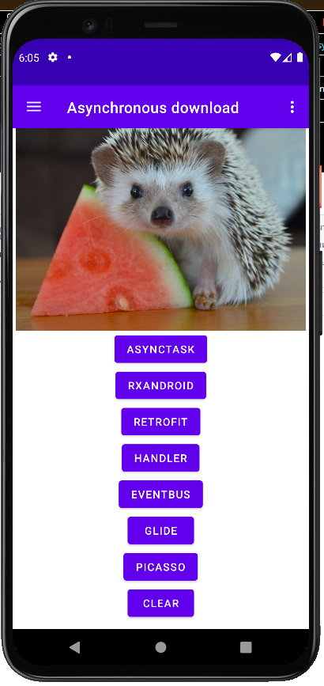
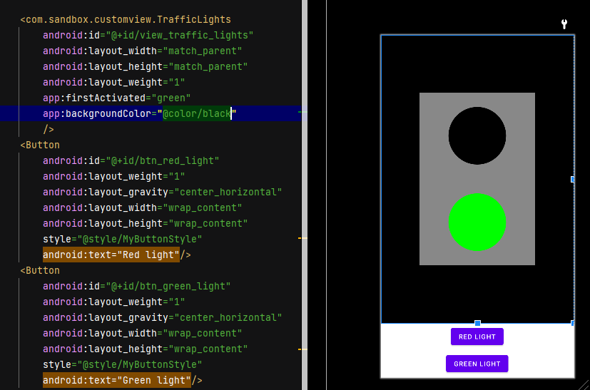
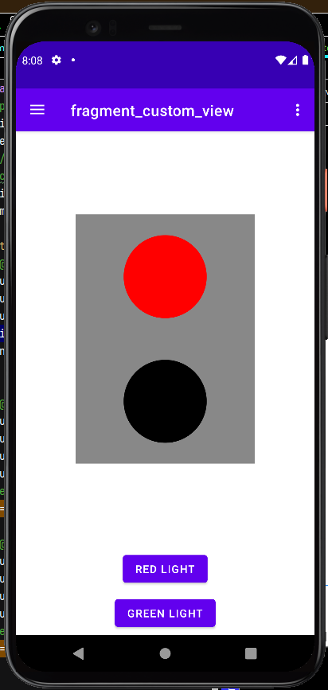
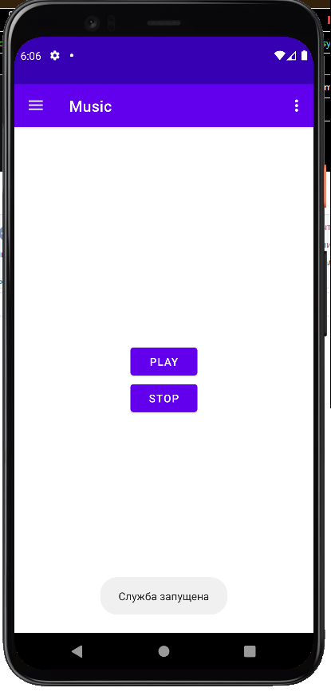
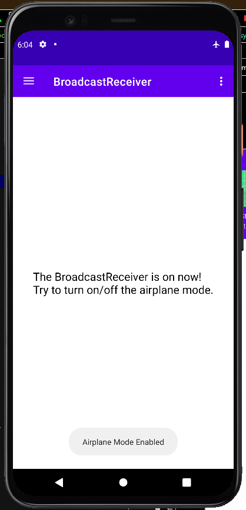
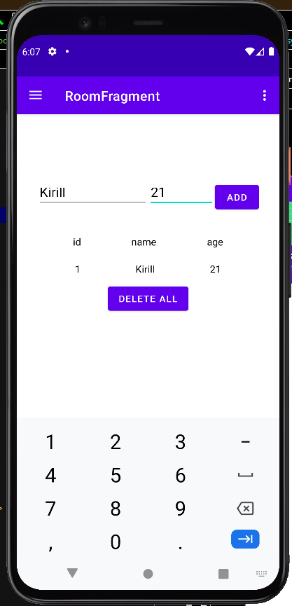
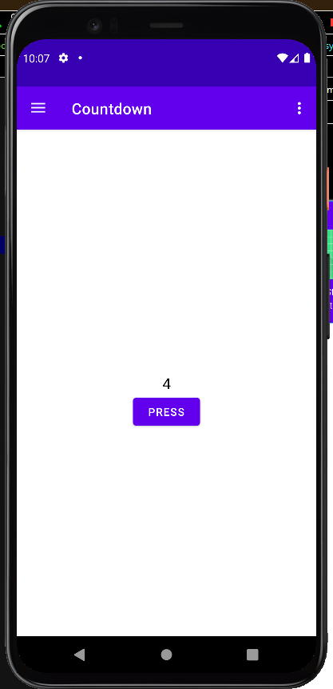

# Sandbox
Приложение, в котором я пробую новое и закрепляю старое. Части этого приложения использую как шаблон.

### Загрузка изображения
Тут разные способы скачать картинку

### Кастомный View
У светофора может гореть либо красный, либо зелёный сигнал.
Сигнал и цвет фона можно задать с атрибутах.
Сменить сигнал можно программно.

### Запуск сервиса с музыкой

### BroadcastReceiver

### Room
Базовые запросы к БД

### Обратный отсчёт
Реализация обратного счетчика в Android

